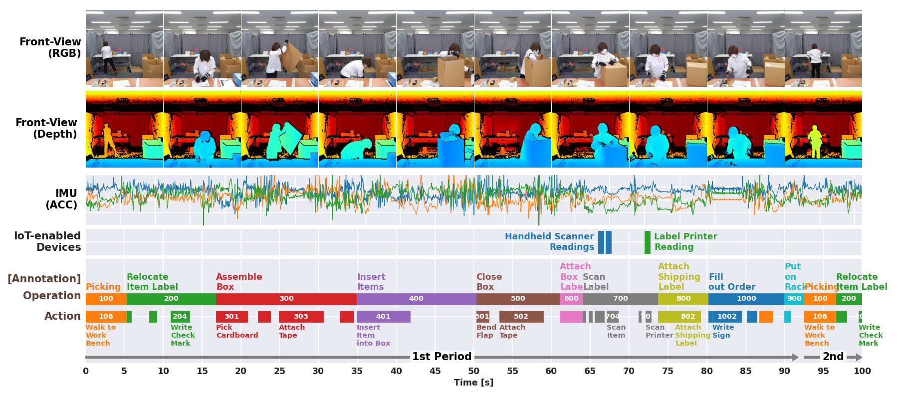

# OpenPack Dataset

[OpenPack Dataset](https://open-pack.github.io/) is a new large-scale multi-modal dataset of packing processes.
This repository provides download instruction and technical details for the OpenPack Dataset.

## Contents

- [OpenPack Dataset](#openpack-dataset)
  - [Contents](#contents)
  - [What is OpenPack dataset?](#what-is-openpack-dataset)
    - [Large Scale activity dataset in Industrial Domain](#large-scale-activity-dataset-in-industrial-domain)
    - [Rich Modalities - Vision + Wearable + IoT Device](#rich-modalities---vision--wearable--iot-device)
    - [Rich Meta Data](#rich-meta-data)
  - [Documentation](#documentation)
  - [Download OpenPack Dataset (v1.0.0)](#download-openpack-dataset-v100)
    - [Data Repository](#data-repository)
    - [Download from Zenodo](#download-from-zenodo)
    - [Donwload from Google Drive](#donwload-from-google-drive)
    - [Download from Google Drive (RGB)](#download-from-google-drive-rgb)
  - [Tools](#tools)
  - [License](#license)

## What is OpenPack dataset?

OpenPack is an open access logistics-dataset for human activity recognition, which contains 53 hours of human movement data with 20,129 instances of work operation annotation.
In addition, OpenPack dataset contains data from IoT-enabled devices and rich metadata such as error annotation and order information.

This repo focuses on technical documentation.
For more information, including dataset features and visual samples, please visit [OpenPack Dataset Official Web](https://open-pack.github.io/).



## Documentation

Detail infomrmation of this dataset is available under [docs/](./docs) folder.

- [OpenPack Dataset - Documentation](./docs/README.md)
  - [Reocrding Sessions](./docs/SESSIONS.md)
  - Data
    - [Sensor Modality (Data Stream)](./docs/DATA_STREAM.md)
    - [Subjects-related Metadata](./docs/SUBJECTS.md)
    - [System Metadata](./docs/METADATA.md)
  - Annotation
    - [Activity Class Definition](./docs/ANNOTATION.md)
  - Benchmark
    - [Data Split](./docs/DATA_SPLIT.md)

## Download OpenPack Dataset (v1.0.0)

### Data Repository

OpenPack dataset is available in 3 repository.
Different repositories provide different sets of data with different licenses.
Please refer to the table below to select the repository best fit for your requirements.
Instructions for downloading each dataset come after this table.

| -                       | GitHub (openpack-dataset) | Zenodo          | Google Drive    | Google Drive (RGB)              |
| ----------------------- | ------------------------- | --------------- | --------------- | ------------------------------- |
| **Modality (Wearable)** |                           |                 |                 |                                 |
| Acceleration            | x                         | o               | o               | x                               |
| Gyroscope               | x                         | o               | o               | x                               |
| Orientation             | x                         | o               | o               | x                               |
| EDA                     | x                         | o               | o               | x                               |
| BVP                     | x                         | o               | o               | x                               |
| Temperature             | x                         | o               | o               | x                               |
|                         |                           |                 |                 |                                 |
| **Modality (Vision)**   |                           |                 |                 |                                 |
| Keypoints               | x                         | o               | o               | x                               |
| Depth (PNG)             | x                         | x               | o               | x                               |
| Depth (LiDAR)           | x                         | x               | o               | x                               |
| RGB Images              | x                         | x               | x               | o                               |
|                         |                           |                 |                 |                                 |
| **Modality (Others)**   |                           |                 |                 |                                 |
| IoT Device              | x                         | o               | o               | x                               |
| Meta Data               | x                         | o               | o               | x                               |
| Annotation              | x                         | o               | o               | x                               |
|                         |                           |                 |                 |                                 |
| **License**             | CC BY-NC-SA 4.0           | CC BY-NC-SA 4.0 | CC BY-NC-SA 4.0 | OpenPack Dataset (+RGB) License |

### Download from Zenodo

Data except images is available in [zenodo (DOI: 10.5281/zenodo.8145223)](https://zenodo.org/records/8145223).
Go to this page and download the files one by one.

Alternatively, you can use [this command](./release/v1.0.0/download_from_zenodo.sh) to download and extract the all files at the same time.

```bash
bash ./release/v1.0.0/download_from_zenodo.sh <PATH TO YOUR DATASET ROOT DIRECTORY>

# Example:
bash ./release/v1.0.0/download_from_zenodo.sh ../data/datasets
```

The data on the zenodo is distributed under [CC BY-NC-SA 4.0](https://creativecommons.org/licenses/by-nc-sa/4.0/legalcode) license.

### Donwload from Google Drive

Dataset including depth images is available at [this Google Drive folder](https://drive.google.com/drive/folders/10hYJYkhPRgf-uTToUm5KR99EHkH2v9GB?usp=drive_link).
Inside this folder you will find one zip file for each subject. Please download them manually one by one.

The data in this Google Drive folder is distributed under [CC BY-NC-SA 4.0](https://creativecommons.org/licenses/by-nc-sa/4.0/legalcode) license.

### Download from Google Drive (RGB)

For some subjects, RGB images can also be available.
However, RGB images are distributed under [OpenPack Dataset (+RGB) License](./licenses/OPENPACK_DATASET_RGB_LICENSE.md).
The usage of this dataset is limited to the academic research ONLY, any direct or indirect commercial use is NOT allowed.

You must first apply through ["OpenPack Dataset - Access Request Form"](https://docs.google.com/forms/d/e/1FAIpQLScrRWe-qTQV5CKTBxtLQZ7ScgLsHFWxXRmD5he04qXRVBAtqg/viewform?usp=sf_link) and we will confirm your qualification.
Once approved, we will share the data with Read Only access to your google account.

## Tools

OpenPack offers a variety of tools, including data loading tools and a benchmark pipeline implementation.
Below are links to the available tools.

- [OpenPack Dataset - Official Web](https://open-pack.github.io/)
  - Visual information about the OpenPack dataset.
  - Results of OpenPack Challenge 2022 (@PerCom 2023 WS BiRD)
- [OpenPack Dataset Toolkit (GitHub: openpack-toolkit)](https://github.com/open-pack/openpack-toolkit)
  - Utility to load and transoform the OpenPack dataset.
  - It provides functions and snippets for combining sensor data with different sampling rates and ground truth in Python.
  - A sample notebook to visualize dataset is available.
- [OpenPack Dataset PyTorch Utilities (GitHub: openpack-torch)](https://github.com/open-pack/openpack-torch)
  - PyTorch utilities to work around with OpenPack Dataset.
  - It provides implementations of baseline models sich as U-Net, DeepConvLSTM.
  - A pipeline for benchmarking (model training and testing) is implemented with [PyTorch Lightning](https://github.com/Lightning-AI/pytorch-lightning).
  - Tutorial notebooks for U-Net and DeepConvLSTM are available.
- [YouTube: OpenPack Dataset](https://youtube.com/@openpackdataset6864?si=2VemMXqnXexe_f-4)
  - Samples of depth recordings and tutorial session for OpenPack Challenge 2022 are available.

## Contact

If you have any question about OpenPack dataset, please post them to [Issues](https://github.com/open-pack/openpack-dataset/issues) and assign them to Naoya Yoshimura ( @getty708 ) or Jaime Morales ( @MorJaime ).
We will be happy to help you.

## Acknowledgement

This work is partially supported by JSPS KAKENHI JP21H03428, JP21H05299, JP21J10059, JST ACT-X JPMJAX200T.
We greatly appreciate Chikako Kawabe, Kana Yasuda, and Makiko Otsuka for their efforts in developing the OpenPack dataset.


## License

[OpenPack Dataset](https://doi.org/10.5281/zenodo.5909086) itself is available under [Creative Commons Attribution Non Commercial Share Alike 4.0 International](https://creativecommons.org/licenses/by-nc-sa/4.0/legalcode) license.
However, [OpenPack Dataset (+RGB) License](./licenses/OPENPACK_DATASET_RGB_LICENSE.md) is applied to "OpenPack Dataset (+RGB)" which includs RGB data.
